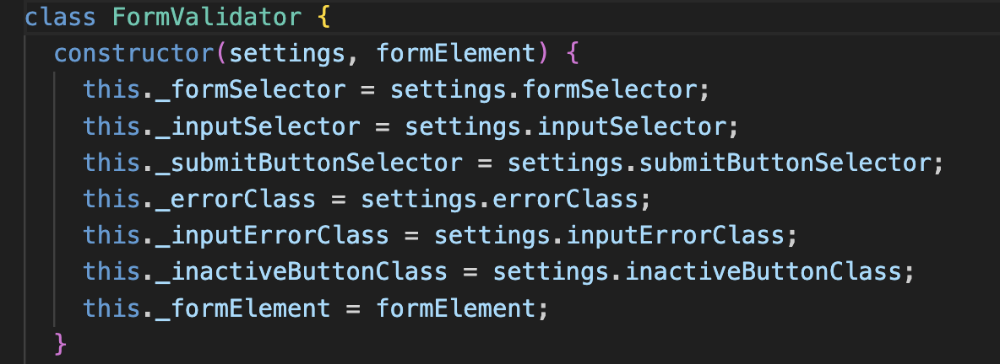

# Task Master App

This quick and easy to use app will serve to keep your endless list of tasks all in one place, and you can even assign due dates for each task!

## Functionality

To add a task use the add todo button to give it a name, and optionally a due date. You can check the tasks as done or even delete them with the delete button.

## Technology

With this project, I refactored some code utilized JavaScript Modules, JavaScript Classes, and Object Methods to create an application that aligns with Object Oriented Programming. Here is an example of a class I used for validation and a settings object that I references across the project.

## Deployment

This project is deployed on GitHub Pages:

-
